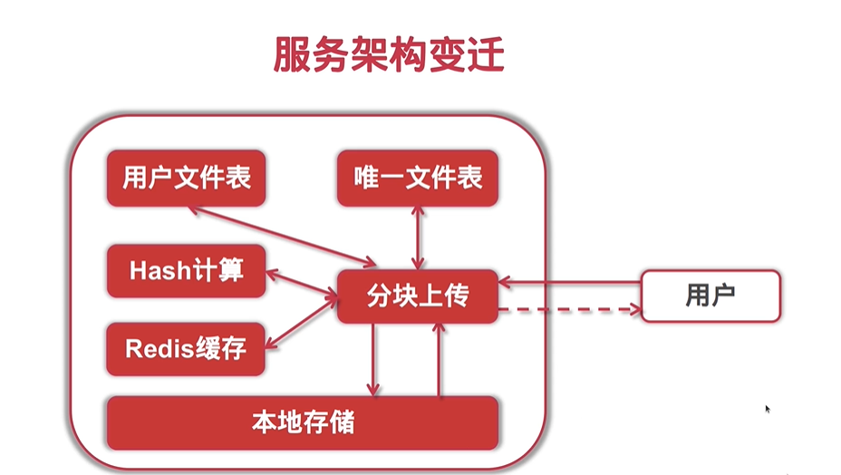

# SCUTMSC-DFS

A distributed file system powered by and applied on South China University of Technology Microsoft Student Club.

*Copyright © SCUT Microsoft Student Club. All rights reserved.*

---

## Architecture



## Features

- [x] User Signup / Signin
- [x] **Authorization Interceptor**
- [ ] **Session Management**
- [x] File Upload / Download
- [x] **Fast Upload**
- [x] **Multipart Upload**
- [ ] **Breakpoint-resumed Download**

## API List

| API Description | API Method |    API URL     |
| :-------------: | :--------: | :------------: |
|      Index      |    GET     |       /        |
|   File Upload   |    POST    |  /file/upload  |
|   File Update   |    PUT     |  /file/update  |
|  File Download  |    GET     | /file/download |
|   File Query    |    GET     |  /file/query   |
|   File Delete   |   DELETE   |  /file/delete  |
|   User Signup   |    POST    |  /user/signup  |
|   User Signin   |    POST    |  /user/signin  |
|    User Info    |    GET     |   /user/info   |

## Quick Start

- **Start the server**

  ```bash
  go run main.go
  ```

- **Browse the client**

  Enter `http://localhost:8080` .

- **User sign up**

  Follow the page guide.

- **User sign in**

  Follow the page guide.

- **Get user info**

  ```http
  GET /user/info/?nickname=${nickname} HTTP1.1
  ...
  ```

- **Upload the file**

  Follow the page guide.

- **Update the file**

  ```http
  PUT /file/update HTTP1.1
  ...
  
  optionType=${optionType}
  &
  fileSha1=${fileSha1}
  &
  fileName=${fileName}
  ```

- **Download the file**

  ```http
  GET /file/download/?fileSha1=${fileSha1} HTTP1.1
  ...
  ```

- **Query the file(s)**

  when querying a single file by file hash:

  ```http
  GET /file/query/filehash/?fileSha1=${fileSha1} HTTP1.1
  ...
  ```

  when querying batch files by limit count

  ```http
  GET /file/query/limitcount/?limitCount=${limitCount} HTTP1.1
  ...
  ```

- **Delete the file**

  ```http
  DELETE /file/delete HTTP1.1
  ...
  
  fileSha1=${fileSha1}
  ```

## Dependency

- [httprouter](http://github.com/julienschmidt/httprouter)
- [mysql](http://github.com/go-sql-driver/mysql)
- [redis](http://github.com/garyburd/redigo/redis)
