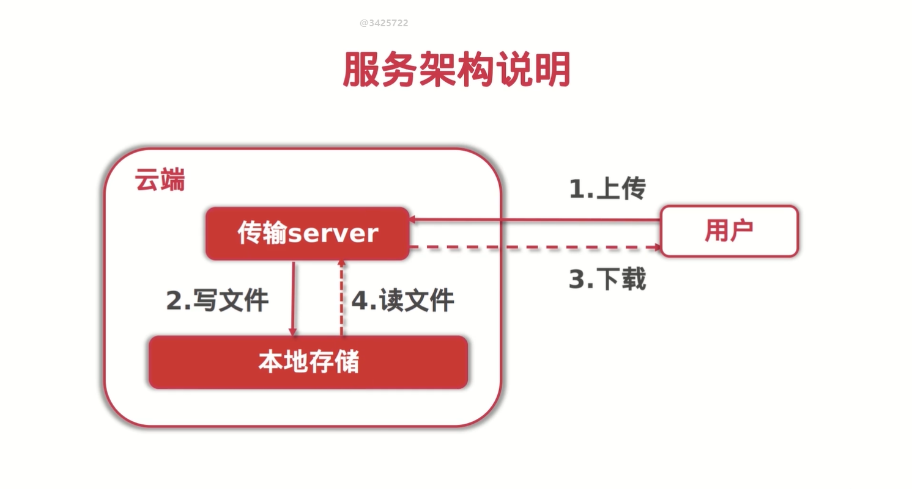

# SCUTMSC-DFS

A distributed file system powered by and applied on South China University of Technology Microsoft Student Club.

*Copyright © SCUT Microsoft Student Club. All rights reserved.*

---

[TOC]

## Architecture



**File Upload Flow:**

1. **Browser clients** upload files to **the http server**

2. **The http server** write files into **physical disks**

**File Download Flow:**

3. **The http server** read files outta **physical disks**

4. **Browser clients** download files from **the http server**

## API List

| API Description | API Method |    API URL    |
| :-------------: | :--------: | :-----------: |
|      Index      |    GET     |       /       |
|   File Upload   |    POST    |  /dfs/upload  |
|   File Update   |    PUT     |  /dfs/update  |
|  File Download  |    GET     | /dfs/download |
|   File Query    |    GET     |  /dfs/query   |
|   File Delete   |   DELETE   |  /dfs/delete  |

## Quick Start

- **Start the server**

  ```bash
  go run main.go
  ```

- **Browse the client**

  Enter `http://localhost:8080` .

- **Upload the file**

  Follow the page guide.

- **Update the file**

  ```http
  PUT /update HTTP1.1
  ...
  
  optionType=${optionType}
  &
  fileHash=${fileHash}
  &
  fileName=${fileName}
  ```

- **Download the file**

  ```http
  GET /dfs/download/:fileHash HTTP1.1
  ...
  ```

- **Query the file(s)**

  when querying a single file by file hash:

  ```http
  GET /dfs/query/filehash/:fileHash HTTP1.1
  ...
  ```

  when querying batch files by limit count

  ```http
  GET /dfs/query/limitcount/:limitCount HTTP1.1
  ...
  ```

- **Delete the file**

  ```http
  DELETE /delete HTTP1.1
  ...
  
  fileHash=${fileHash}
  ```

## Dependency

- [httprouter](http://github.com/julienschmidt/httprouter)
